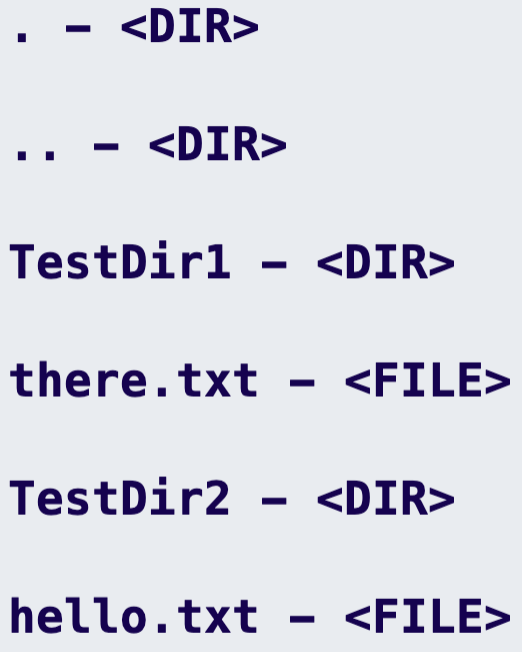

<!-- Program Name / Main Header -->

  <h1 style="font-size: 50px;">~ LemmeSee ~</h1>
  <h3 style="font-weight: bold;">Kaycee Ingram  <pre><code>kazewaze</code></pre></h3>

<!-- Program Info Section -->

  <h3 style="font-size: 20px;"><strong>A command-line utility for finding folders, files, and content.</strong></h3>
  <h3><em>Currently the program just functions as a knock-off of the <code style="color: #180153; background-color: #E8ECF0;">ls</code> command</em>.</h3>
  <h3><em>The <code style="color: #180153; background-color: #E8ECF0;">tests</code> directory is provided with the program so you can try it out</em>.</h3>
  <h3>
    If the user wants to list the contents of a nested DIR, such as <code style="color: #180153; background-color: #E8ECF0;">TestDir1</code> located in the <code style="color: #180153; background-color: #E8ECF0;">tests</code> folder provided, then they would enter the following path like so  (shown in step 3 below, but modified): <pre style="margin-top: 10px;"><code>$> Enter target path: tests/TestDir1</code></pre>
    Be sure to <strong>NOT</strong> include the last forward slash (<em>after TestDir1 in the example above</em>), the lemmesee program will include it for you!
  </h3>

<!-- Program Usage Section -->

  <h1 style="text-align: center;">Example Usage</h1>
    <ol>
      

        
<strong>Compile It (gcc)</strong>

        <li style="margin-top: -20px; font-weight: bold;"><pre><code>$> gcc main.c -o lemmesee</code></pre>
      

      

        
<strong>Run It</strong>

        <li style="margin-top: -20px; font-weight: bold;"><pre><code>$> ./lemmesee</code></pre></li>
      

      

        
<strong>Enter your target path</strong>

        <li style="margin-top: -20px; font-weight: bold;"><pre><code>$> Enter target path: tests</code></pre></li>
      

      

        <h3><strong>The following output is displayed</strong></h3>
        <h3 style="margin-top: -5px; font-weight: bold;">
          
        </h3>
      

</ol>

